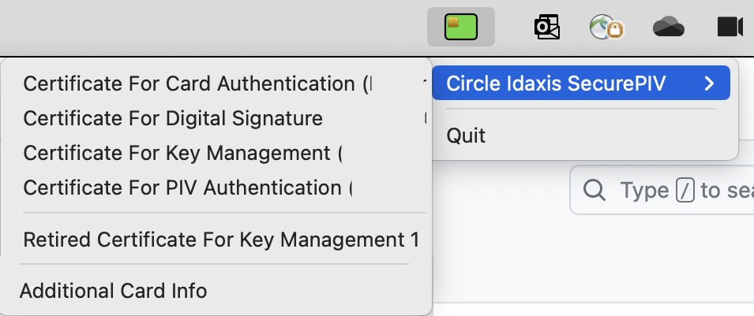
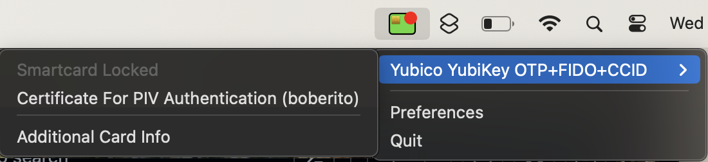

# sc_menu
Simple smartcard Menu item

Shows a green smartcard icon when the card is inserted. Shows a blank smartcard icon when the card is not inserted. It also allows you to view the certificates on the smartcard.







If you want to disallow user's from being prompted to update SC Menu or have the ability to check for updates.

SC Menu can be registered and unregistered to load at login

`./SC\ Menu.app/Contents/MacOS/SC\ Menu --register`
* Adds to Login Items

`./SC\ Menu.app/Contents/MacOS/SC\ Menu --unregister`
* Removes from Login Items


SC Menu can be configured by Configuration Profile deployed by your MDM.

**Domain** `com.ttinc.sc-menu`

`disableUpdates` - **Type: Boolean**\
Acceptable Value: **true** or **false**\
Disables "Check for Updates" button and disables the auto-update check on launch.

`showNotifications` - **Type: Boolean**\
Acceptable Value: **true** or **false**\
When mixed with the Notifications payload, it will lock notifications on or off.

`run_on_insert` - **Type: Boolean**\
Acceptable Value: **true** or **false**\
Enables or Disables the ability to run a script on smartcard insertion.

`run_on_insert_script_path` - **Type: String**\
Acceptable Value: **Path to a script**\
POSIX path to a script to run on smartcard insert.

`run_on_removal` - **Type: Boolean**\
Acceptable Value: **true** or **false**\
Enables or Disables the ability to run a script on smartcard removal.

`run_on_removal_script_path` - **Type String**\
Acceptable Value: **Path to a script**\
POSIX path to a script to run on smartcard removal.


Example mobileconfig
```
<?xml version="1.0" encoding="UTF-8"?>
<!DOCTYPE plist PUBLIC "-//Apple//DTD PLIST 1.0//EN" "http://www.apple.com/DTDs/PropertyList-1.0.dtd">
<plist version="1.0">
<dict>
    <key>PayloadContent</key>
    <array>
        <dict>
            <key>PayloadIdentifier</key>
            <string>com.ttinc.sc-menu.26F7424C-FEF3-4E94-8E78-2673B2B8CDD3</string>
            <key>PayloadType</key>
            <string>com.ttinc.sc-menu</string>
            <key>PayloadUUID</key>
            <string>26F7424C-FEF3-4E94-8E78-2673B2B8CDD3</string>
            <key>PayloadVersion</key>
            <integer>1</integer>
            <key>disableUpdates</key>
            <true/>
            <key>run_on_insert</key>
            <true/>
            <key>run_on_insert_script_path</key>
            <string>/Users/Shared/insert-piv.sh</string>
            <key>run_on_removal</key>
            <true/>
            <key>run_on_removal_script_path</key>
            <string>/Users/Shared/myscript.sh</string>
            <key>show_notifications</key>
            <true/>
        </dict>
    </array>
    <key>PayloadDescription</key>
    <string>Disables Updates for SC Menu</string>
    <key>PayloadDisplayName</key>
    <string>SC Menu Disable Updates</string>
    <key>PayloadIdentifier</key>
    <string>com.ttinc.sc-menu</string>
    <key>PayloadOrganization</key>
    <string>BOB</string>
    <key>PayloadScope</key>
    <string>System</string>
    <key>PayloadType</key>
    <string>Configuration</string>
    <key>PayloadUUID</key>
    <string>1BBD23DE-7ED7-45DF-8126-5085A681ED83</string>
    <key>PayloadVersion</key>
    <integer>1</integer>
</dict>
</plist>
```

